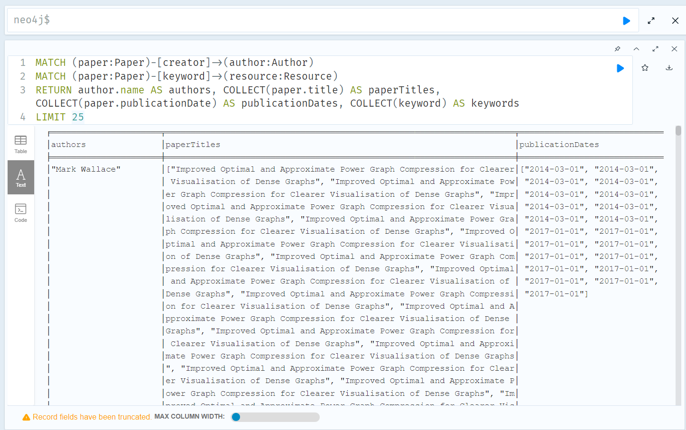

# Neo4j Query Exploration Documentation
## Querying Basics:
#### Knowledge graph loaded into neo4j looks like this:
 
#### Query using neo4j’s node labels and relationship types look like this:
 
#### Query (fetch data) using cypher:
```
MATCH(n:Author)
RETURN(n.name)AS authors,(n.uri)
```

 

## Querying Functions:
#### 1)	function: given an author name, find his/her publicized paper titles and keywords, publication time
#### Query Cypher Code:
```
MATCH (paper:Paper)-[creator]->(author:Author)
MATCH (paper:Paper)-[keyword]->(resource:Resource)
RETURN author.name AS authors, COLLECT(paper.title) AS paperTitles, COLLECT(paper.publicationDate) AS publicationDates, COLLECT(keyword) AS keywords
LIMIT 25
```
 
> [!NOTE]
> **LIMIT 25** returns 25 entries and can be removed or changed as needed depending on query needs

#### 2)	function: given a keyword (e.g. *machine learning*), find all the related papers;

  a)	What are the keywords we are interested in? Perform a text search and compare keywords within the Paper node to extract from the research paper’s abstract.
#### Query Cypher Code:
```
MATCH (paper:Paper)
WHERE paper.abstract CONTAINS 'machine learning'
RETURN paper.title AS papersWithKeyword, paper.abstract AS manualCheckKeyword
```
  
> [!NOTE]
> **manualCheckKeyword** was used to spot check that the papers pulled up indeed had the keyword “machine learning”; can be omitted in the query function as seen below
#### Query Cypher Code:
```
MATCH (paper:Paper)
WHERE paper.abstract CONTAINS 'machine learning'
RETURN paper.title AS papersWithKeyword
```
  

b)	find all the related authors who have publicized papers on that keyword.
#### Query Cypher Code:
```
MATCH (paper:Paper)-[creator]->(author:Author)
MATCH (paper:Paper)-[keyword]->(resource:Resource)
WHERE paper.abstract CONTAINS 'machine learning'
RETURN author.name AS authors, COLLECT(paper.title) AS papersWithKeyword
```


c)	find all the related keywords and count their occurrence.
#### Query Cypher Code:
```
MATCH (paper:Paper)
WHERE paper.abstract CONTAINS 'machine learning'
RETURN COUNT(*) AS keywordOccurrenceCount
```


d)	group papers according to year, check their evolution.
#### Query Cypher Code:
```
MATCH (paper:Paper)-[keyword]->(resource:Resource)
RETURN DISTINCT paper.title AS paperTitles, paper.publicationDate AS publicationDates
ORDER BY publicationDates ASC
```
  
> [!NOTE]
> Using **DISTINCT** eliminates duplicate entries from the Neo4j query results; using **ASC** categorizes and orders paper by year from earliest to latest (can be changed to **DESC** if ordering from latest publication date to earliest is desired)

