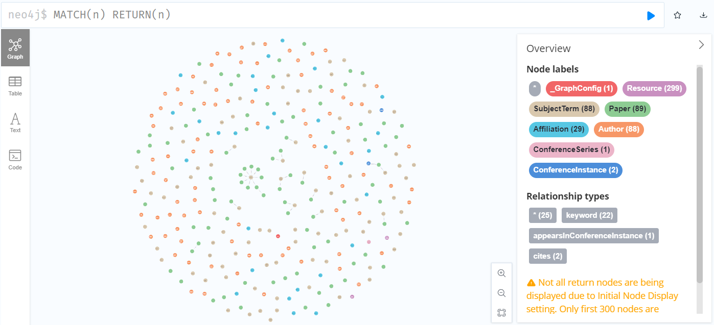
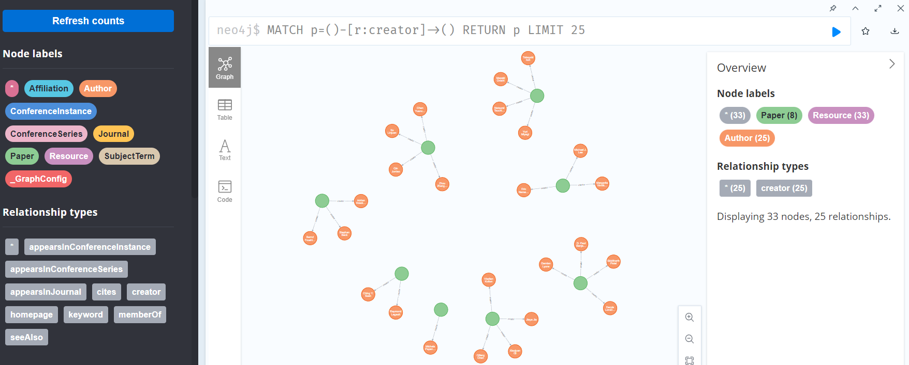
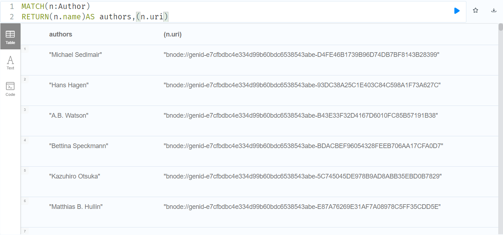
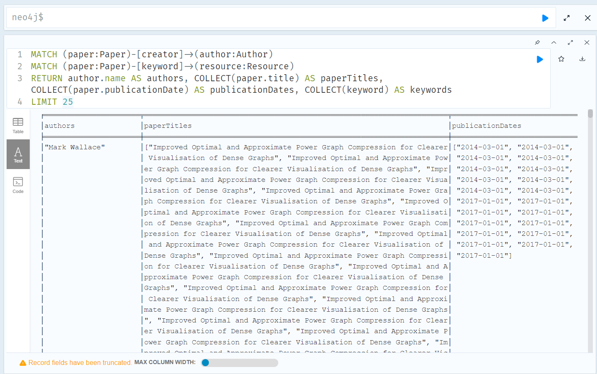
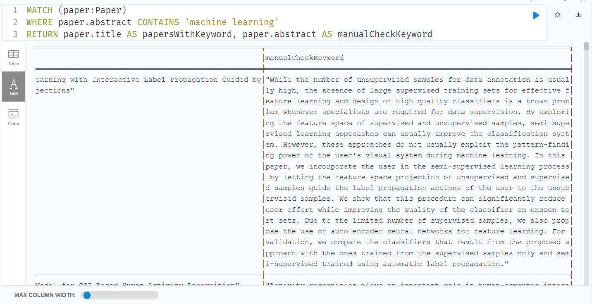
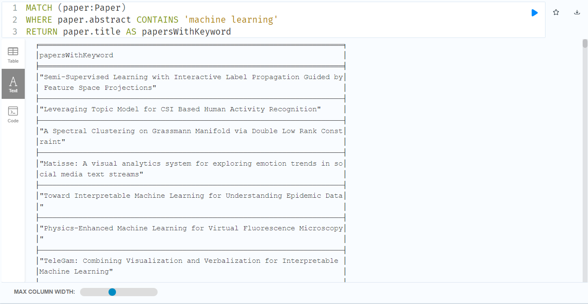
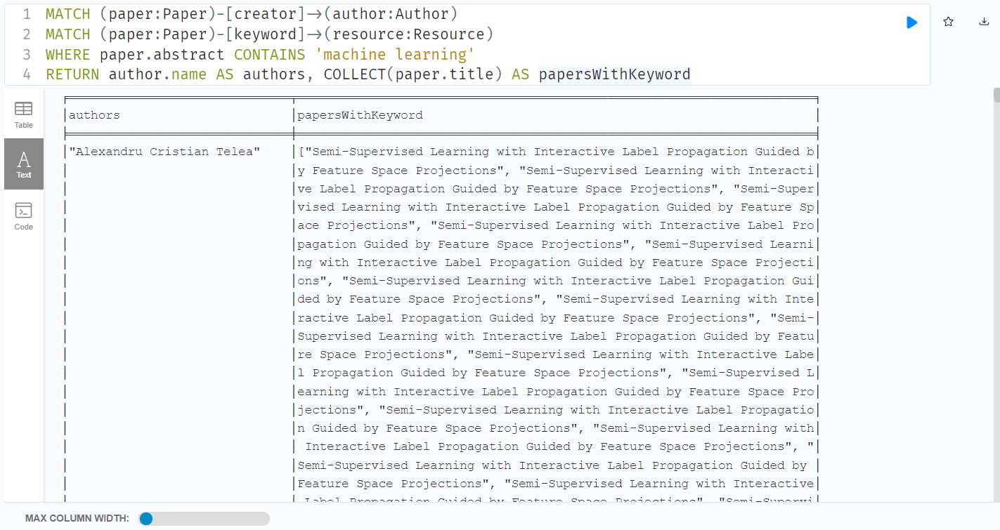
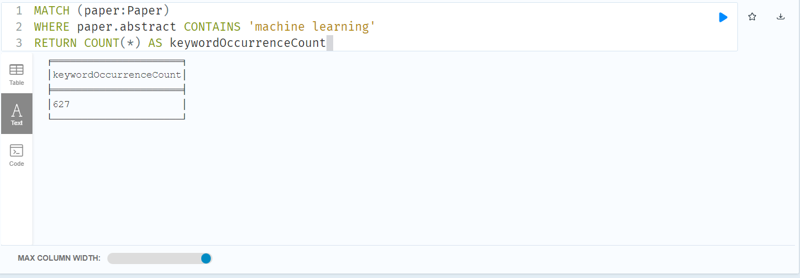
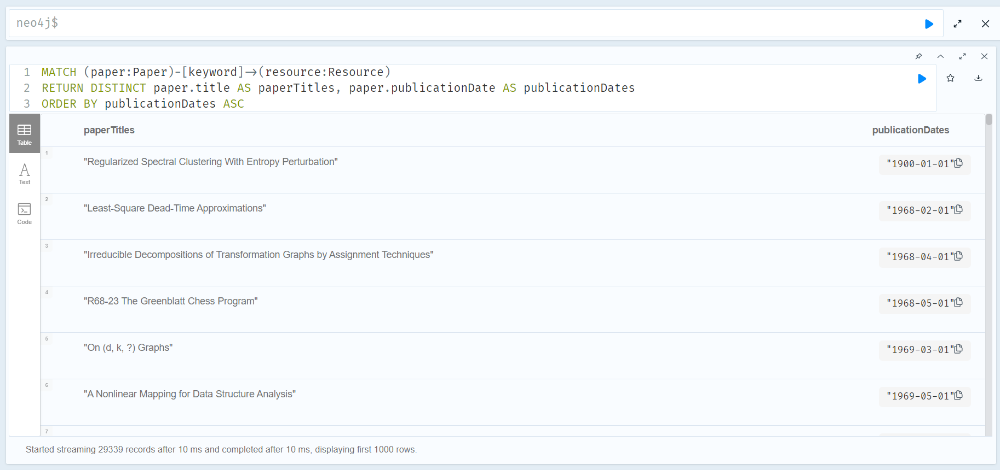

# KG-PRE-view: Democratizing a TVCG Knowledge Graph through Visual Explorations

## Introduction: 
Welcome to the TVCG Knowledge Graph (TVCG-KG) GitHub Repository!

Are you interested in gaining valuable insights from the vast repository of IEEE digital library data? Look no further! The IEEE digital library currently offers access to individual papers, but transforming this wealth of data into actionable insights can be a daunting task that requires specialized expertise and considerable effort in tasks such as data crawling, cleaning, analysis, and visualizations.

To meet the needs of our community and make decision-making more efficient and transparent, we have taken on the challenge of constructing and publicly releasing the TVCG Knowledge Graph (TVCG-KG). TVCG-KG is a structured representation of heterogeneous information, encompassing metadata for each publication, including author details, affiliations, titles, and semantic information such as methods, tasks, and data.

In this GitHub repository, you will find the tools, resources, and documentation necessary to access and utilize TVCG-KG for your research, analysis, and decision-making needs. We invite you to explore and collaborate with us as we work towards harnessing the power of knowledge graphs to unlock insights from the world of IEEE publications.

Get started today and embark on your journey to more efficient and informed decision-making with TVCG-KG! Feel free to contribute, ask questions, and be part of this exciting initiative.

## Online Demo for the usage scenarios
[Visit online demos in our paper](https://observablehq.com/d/53ebb00b451f79a6)

## Access to the TVCG-KG through Neo4j - (Cloud)
### Javascript 
```javascript
neo4j = require("neo4j-driver@4.4.1")
driver = neo4j.driver("neo4j+s://39c20fbc.databases.neo4j.io", neo4j.auth.basic("publicUsers", "tvcg-knowledge-graph"), {disableLosslessIntegers:true})

async function runQuery(statement) {
  const session = driver.session({ database: "neo4j" });
  let results;

  await session
    .run(statement)
    .then((r) => {
      results = r.records.map((d) => d.toObject());
      session.close();
    })
    .catch((error) => {
      results = error.message;
    });

  return results;
}
```
### Python 
```python
python -m pip install neo4j
from neo4j import GraphDatabase, RoutingControl

URI = "neo4j+s://39c20fbc.databases.neo4j.io"
AUTH = ("publicUsers", "tvcg-knowledge-graph")

```
## Access to the TVCG-KG through Neo4j - (Local)
We provide ttl file that can be loaded into Neo4j directly: 
```python

graph = Graph("bolt://localhost:7687", auth=("neo4j", "123"), name='final')
graph.run("CREATE CONSTRAINT n10s_unique_uri ON (r:Resource) ASSERT r.uri IS UNIQUE")
graph.run("CALL n10s.graphconfig.init();")
graph.run('CALL n10s.graphconfig.init({ handleVocabUris: "IGNORE" })')
graph.run("CALL n10s.rdf.import.fetch({local_path_to_ttl}, 'Turtle');")
```


## Neo4j Query Exploration Documentation
### Querying Basics:
#### Knowledge graph loaded into neo4j looks like this:
 
#### Query using neo4j’s node labels and relationship types look like this:
 
#### Query (fetch data) using cypher:
```
MATCH(n:Author)
RETURN(n.name)AS authors,(n.uri)
```

 

## Querying Functions:
#### 1)	function: given an author name, find his/her publicized paper titles and keywords, publication time
#### Query Cypher Code:
```
MATCH (paper:Paper)-[creator]->(author:Author)
MATCH (paper:Paper)-[keyword]->(resource:Resource)
RETURN author.name AS authors, COLLECT(paper.title) AS paperTitles, COLLECT(paper.publicationDate) AS publicationDates, COLLECT(keyword) AS keywords
LIMIT 25
```
 
> [!NOTE]
> **LIMIT 25** returns 25 entries and can be removed or changed as needed depending on query needs

#### 2)	function: given a keyword (e.g. *machine learning*), find all the related papers;

  a)	What are the keywords we are interested in? Perform a text search and compare keywords within the Paper node to extract from the research paper’s abstract.
#### Query Cypher Code:
```
MATCH (paper:Paper)
WHERE paper.abstract CONTAINS 'machine learning'
RETURN paper.title AS papersWithKeyword, paper.abstract AS manualCheckKeyword
```
  
> [!NOTE]
> **manualCheckKeyword** was used to spot check that the papers pulled up indeed had the keyword “machine learning”; can be omitted in the query function as seen below
#### Query Cypher Code:
```
MATCH (paper:Paper)
WHERE paper.abstract CONTAINS 'machine learning'
RETURN paper.title AS papersWithKeyword
```
  

b)	find all the related authors who have publicized papers on that keyword.
#### Query Cypher Code:
```
MATCH (paper:Paper)-[creator]->(author:Author)
MATCH (paper:Paper)-[keyword]->(resource:Resource)
WHERE paper.abstract CONTAINS 'machine learning'
RETURN author.name AS authors, COLLECT(paper.title) AS papersWithKeyword
```


c)	find all the related keywords and count their occurrence.
#### Query Cypher Code:
```
MATCH (paper:Paper)
WHERE paper.abstract CONTAINS 'machine learning'
RETURN COUNT(*) AS keywordOccurrenceCount
```


d)	group papers according to year, check their evolution.
#### Query Cypher Code:
```
MATCH (paper:Paper)-[keyword]->(resource:Resource)
RETURN DISTINCT paper.title AS paperTitles, paper.publicationDate AS publicationDates
ORDER BY publicationDates ASC
```
  
> [!NOTE]
> Using **DISTINCT** eliminates duplicate entries from the Neo4j query results; using **ASC** categorizes and orders paper by year from earliest to latest (can be changed to **DESC** if ordering from latest publication date to earliest is desired)

